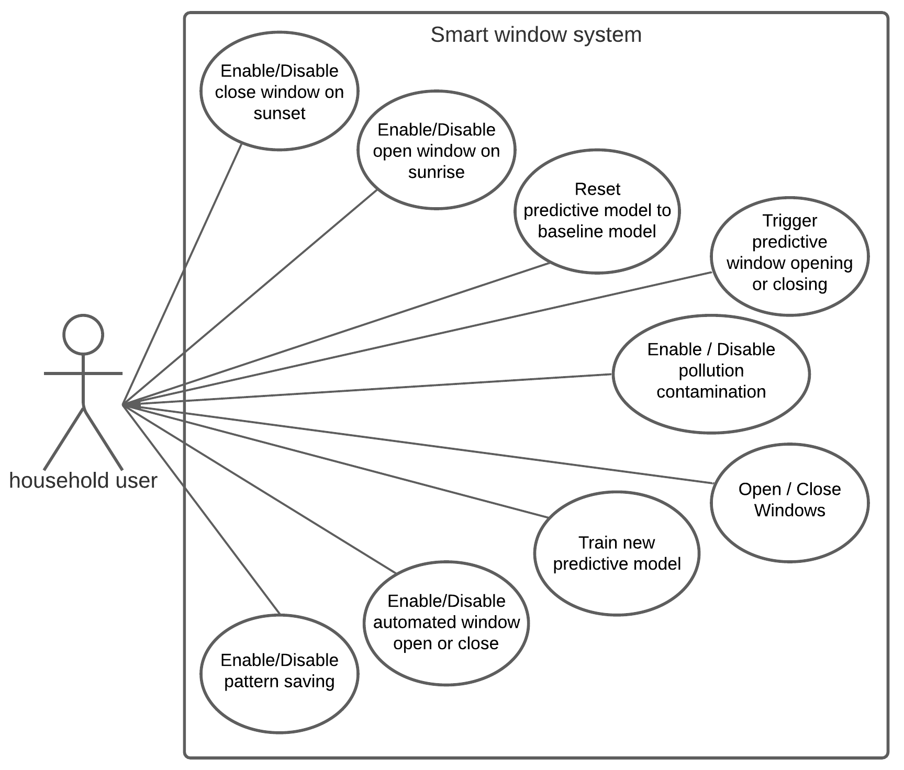
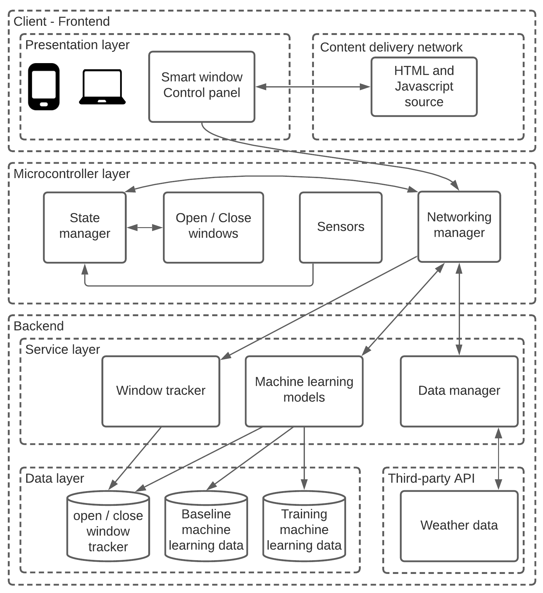
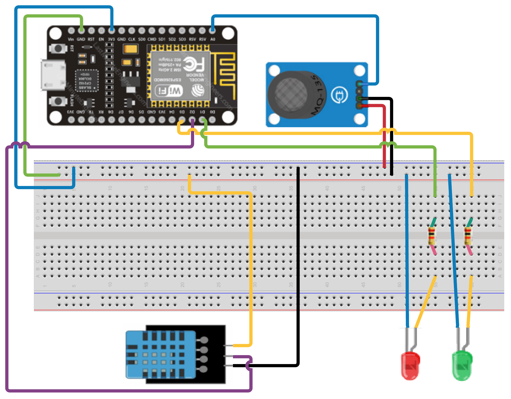

# <b>Home automation: Smart window</b>

## About the project

The recent advancements in hardware, software and connectivity has allowed the implosion of ‘Internet of Things’: Taking appliances and implementing microcontrollers, sensors, algorithms and connecting to the network to do tasks that can be customised and controlled remotely without the user explicitly telling or programming what the appliance should do. The implementation of modern systems such as and advanced automated cleaning robots learns through the behaviour each person and the appliances can customise the tasks to adapt to the needs of each person.

The current implementations of smart window systems primarily focus on a simple implementation of timers or routines but does not take into account the ‘human’ factor and behaviour. Current systems cannot be considered as ‘smart’, for example: opening the windows when certain thresholds are met it’s just a system that detects a pre-programmed (most of the time by the user) value has been reached.

The project ‘smart window’ aims to build:

- Implement to the existing traditional window a set of controllers, sensors and connect to the network so the user can control the behaviour of the window.

- An advanced functionality of learning the patterns from the user by leveraging data, predictive algorithms (neural networks) and automatically closing or opening the window when is required.

- A programmable window that allows the user to tell if the window needs to open or close given a defined scenario and the smart window will fetch data from the network and program itself to fulfil the tasks without the user having to manually set the times to the window (as times and circumstances change often).


## Use case diagram



## System architecture



## Circuit design

Key components needed:
- NodeMCU/ESP8266
- DTH11 Temperature and Humidity sensor
- MQ-135 Gas sensor
- Red Led
- Green Led
- Two resistors (to avoid burning the led)

### How to connect the components:



In detail connection on `/.github/cir-dia.png`

## <b>Running the code</b>

The code was tested and fully functinal on GNU/Linux (Ubuntu 16)

### NodeMCU library installation

Please refer to oficial [NodeMCU/ESP8266](https://nodemcu.readthedocs.io/en/release/getting-started/) installation guide to install the binaries in `/install/nodemcu`
Also includes on how to upload code to the microcontroller. Once installed the binaries, upload the microcontroller code. You will find the source code on `/src/nodemcu/init.lua`

### Additional dependencies

Before running any client or server code please install the dependencies:

- nodeJS v12
- fastAPI
- uvicorn
- keras - tensorflow
- scikit-learn
- pandas

### Client

To initialise the client go to `/src/client` folder and type:

```
npm install
npm start
```

The client will run on `localhost:3000`

### Server

The server runns on `port: 80` and nodeMCU uses the port to communicate with the server. To allow nodeMCU communicate with the server please enable port 80 to be accessed from external devices or enter the following command lines: 

```
sudo /sbin/iptables -I INPUT -p tcp -m tcp --dport 80 -j ACCEPT
```
Once all the dependencies has been installed and the port 80 enabled for outside connections, please go to `/src/server` and type on your terminal:

```
python3 main.py
```

OR if you have already installed uvicorn and it's within the system path, you can also initialise manually the backend using:

```
sudo uvicorn server:app --host 0.0.0.0 --port 80
```

If all the installations and initialization is correct you can access the server side by using your computer local ip.

To check your local computer IP just type on the terminal `ifconfig`.

## <b>IMPORTANT: IP configurations</b>

If the NodeMCU/ESP8266 uses a different local IP (rather than the one set by default) address the client won't be able to communicate with the NodeMCU/ESP8266 as it is hardcoded on `/src/client/src/api/request.js`. Once you run NodeMCU/ESP8266 the local machine IP address should be displayed on the ESP terminal. Moreover, if the server side is running on different local IP then NodeMCU/ESP8266 won't be able to communicate with the server side, in such cases go to `/src/nodemcu/init.lua` and change the ip address to where the server is running.


###### Disclaimer

###### The project is under the MIT License (see LICENSE). The project was developed as part end of year project for the "Internet of Things" undergraduate level module (mark achieved: 90/100). The source code is not currently maintained and updated. If you do require help to run any of the components you can find my email on my Github profile or in muklek.com
